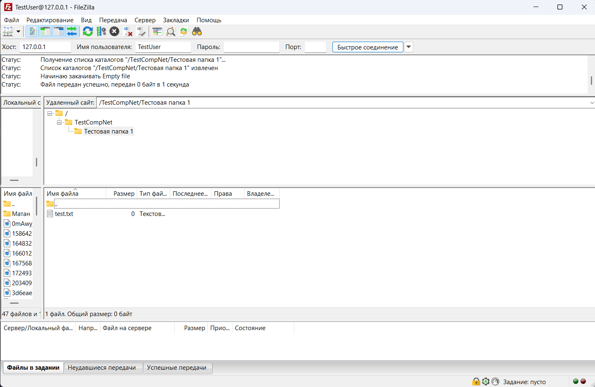

# Практика 6. Транспортный уровень

## Wireshark: UDP (5 баллов)
Начните захват пакетов в приложении Wireshark и затем сделайте так, чтобы ваш хост отправил и
получил несколько UDP-пакетов (например, с помощью обращений DNS).
Выберите один из UDP-пакетов и разверните поля UDP в окне деталей заголовка пакета.
Ответьте на вопросы ниже, представив соответствующие скрины программы Wireshark.

#### Вопросы
1. Выберите один UDP-пакет. По этому пакету определите, сколько полей содержит UDP-заголовок.
   - 4 поля: Source Port, Destination Port, Length, Checksum

   
2. Определите длину (в байтах) для каждого поля UDP-заголовка, обращаясь к отображаемой
   информации о содержимом полей в данном пакете.
   - Source Port (2 байта), Destination Port (2 байта), Length (2 байта), Checksum (2 байта)

   
   
   
   

3. Значение в поле Length (Длина) – это длина чего?
   - это длина всего UDP, включая заголовок и данные (снизу подписано)
4. Какое максимальное количество байт может быть включено в полезную нагрузку UDP-пакета?
   - Если рассматривать IPv4, максимальный размер всего IP-пакета будет 65535 байт, из которых 8 байт уйдет на зоголов UDP и 20 байт на IP-заголовок. Итого останется 65507
5. Чему равно максимально возможное значение номера порта отправителя?
   - Поле отправителя (Source Port) - 16-битное поле, причем там может быть и 0. Значит, максимально возможное значение равно 2^16 - 1 = 65535
6. Какой номер протокола для протокола UDP? Дайте ответ и для шестнадцатеричной и
   десятеричной системы. Чтобы ответить на этот вопрос, вам необходимо заглянуть в поле
   Протокол в IP-дейтаграмме, содержащей UDP-сегмент.
   - Для десятичной 17, для шестнадцатеричной 11
   
7. Проверьте UDP-пакет и ответный UDP-пакет, отправляемый вашим хостом. Определите
   отношение между номерами портов в двух пакетах.
   - В первом запросе порт отправителя 64028, а порт получателя 53. В ответном запросе всё наоборот. порт отправителя 53, а получателя 64028
   
   

## Программирование. FTP

### FileZilla сервер и клиент (3 балла)
1. Установите сервер и клиент [FileZilla](https://filezilla.ru/get)
2. Создайте FTP сервер. Например, по адресу 127.0.0.1 и портом 21. 
   Укажите директорию по умолчанию для работы с файлами.
3. Создайте пользователя TestUser. Для простоты и удобства можете отключить использование сертификатов.
4. Запустите FileZilla клиента (GUI) и попробуйте поработать с файлами (создать папки,
добавить/удалить файлы).

Приложите скриншоты.

#### Скрины

### FTP клиент (3 балла)
Создайте консольное приложение FTP клиента для работы с файлами по FTP. Приложение может
обращаться к FTP серверу, созданному в предыдущем задании, либо к какому-либо другому серверу 
(есть много публичных ftp-серверов для тестирования, [вот](https://dlptest.com/ftp-test/) один из них).

Приложение должно:
- Получать список всех директорий и файлов сервера и выводить его на консоль
- Загружать новый файл на сервер
- Загружать файл с сервера и сохранять его локально

Бонус: Не используйте готовые библиотеки для работы с FTP (например, ftplib для Python), а реализуйте решение на сокетах **(+3 балла)**.

#### Демонстрация работы
- ls

- put

- get (я слишком поздно заметила опечатку)

### GUI FTP клиент (4 балла)
Реализуйте приложение FTP клиента с графическим интерфейсом. НЕ используйте C#.

Возможный интерфейс:

В приложении должна быть поддержана следующая функциональность:
- Выбор сервера с указанием порта, логин и пароль пользователя и возможность
подключиться к серверу. При подключении на экран выводится список всех доступных
файлов и директорий
- Поддержаны CRUD операции для работы с файлами. Имя файла можно задавать из
интерфейса. При создании нового файла или обновлении старого должно открываться
окно, в котором можно редактировать содержимое файла. При команде Retrieve
содержимое файла можно выводить в главном окне.

#### Демонстрация работы
todo

### FTP сервер (5 баллов)
Реализуйте свой FTP сервер, который работает поверх TCP сокетов. Вы можете использовать FTP клиента, реализованного на прошлом этапе, для тестирования своего сервера.
Сервер должен реализовать возможность авторизации (с указанием логина/пароля) и поддерживать команды:
- CWD
- PWD
- PORT
- NLST
- RETR
- STOR
- QUIT

#### Демонстрация работы
todo
